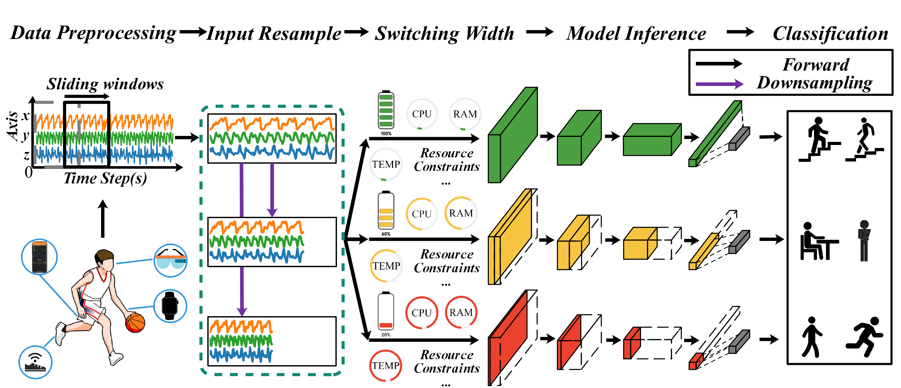
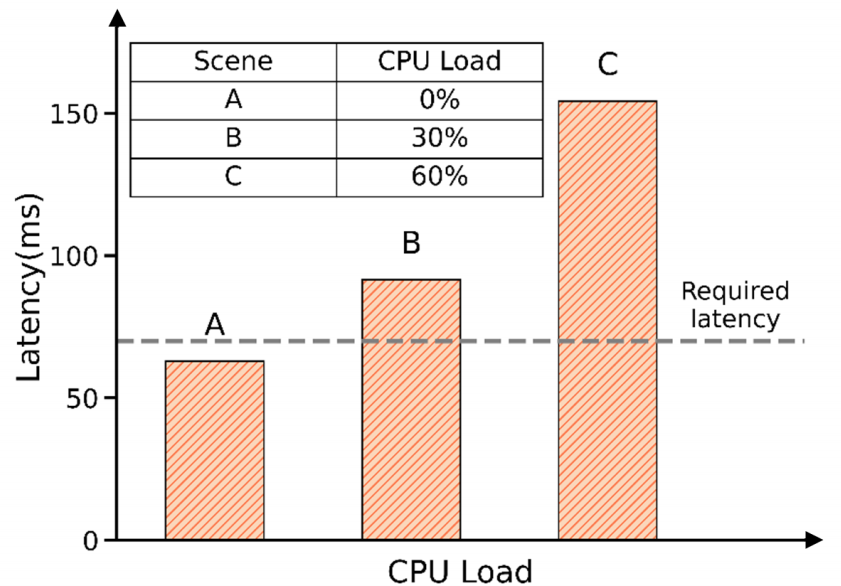
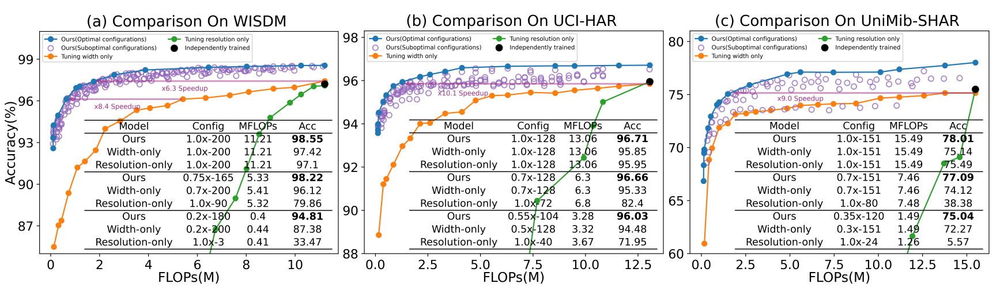
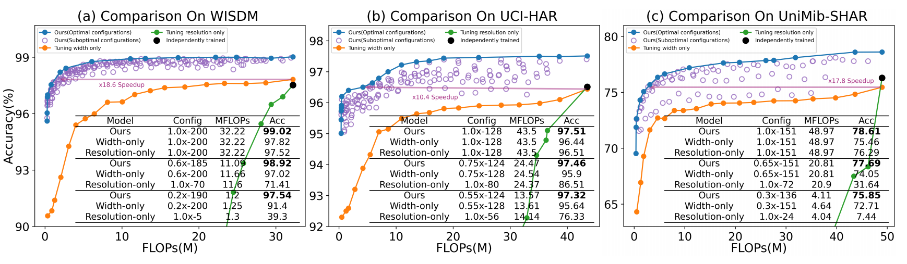
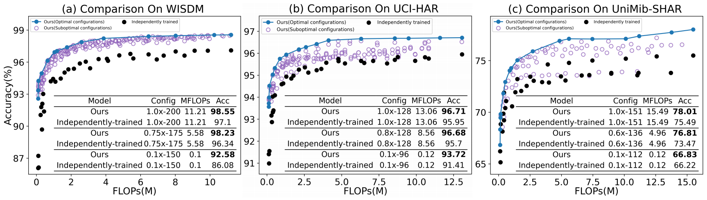
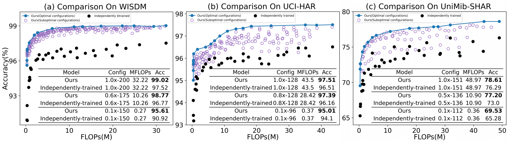
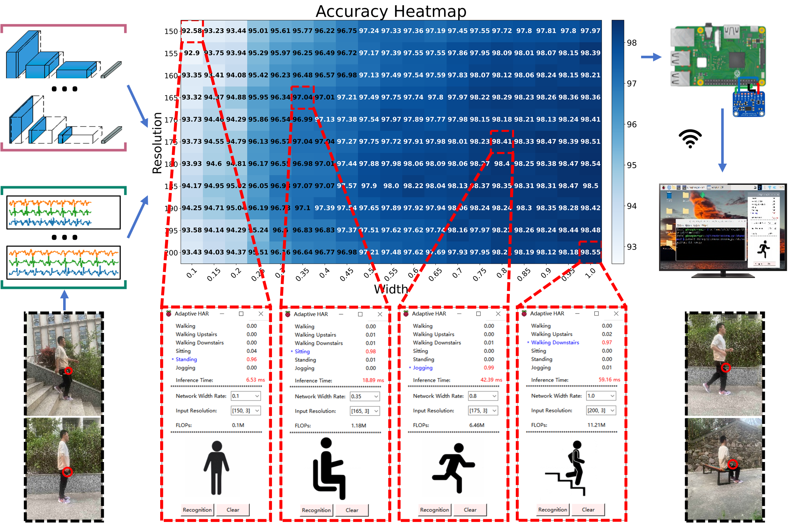
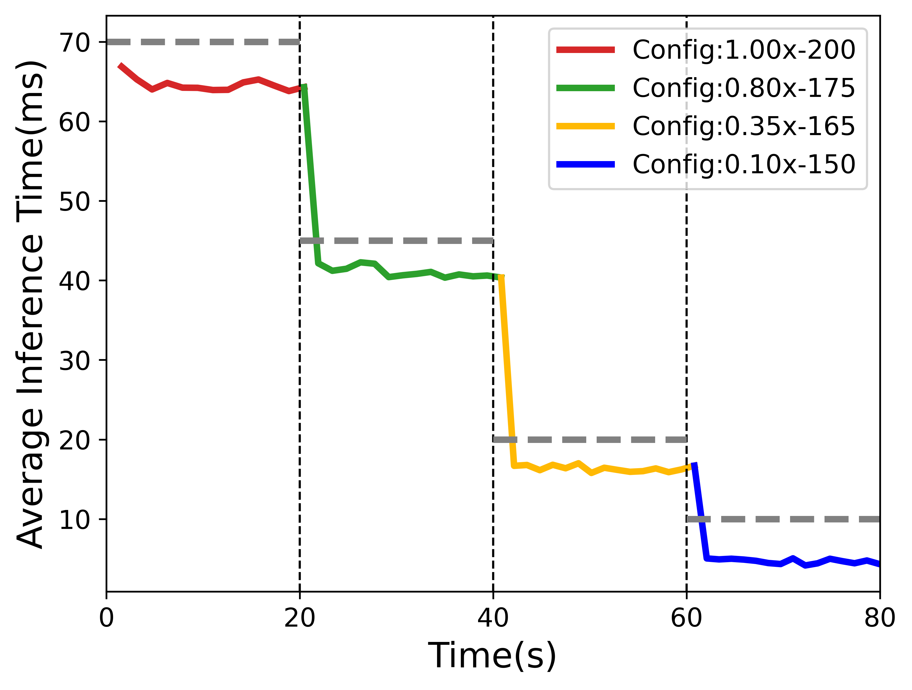
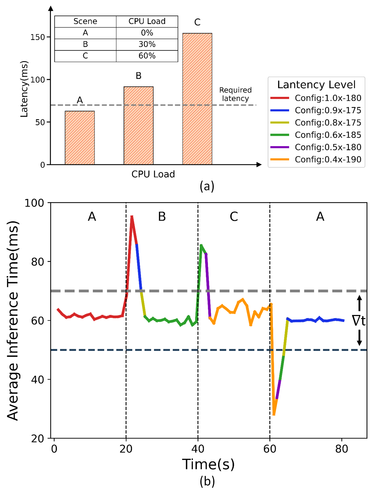

# Towards Better Accuracy-Efficiency Trade-Offs: Dynamic Activity Inference via Collaborative Learning from Various Width-Resolution Configurations

[Lutong Qin](https://lutong-qin.github.io/),  [Lei Zhang*](https://leizhangnjnu.github.io/),  [Chengrun Li](),  [Chaoda Song](), [Dongzhou Cheng](),  [Shuoyuan Wang](),  [Hao Wu](),  [Aiguo Song]()

**Nanjing Normal University  &nbsp; | &nbsp;  Shanghai Jiao Tong University  &nbsp; |&nbsp;  Case Western Reserve University  &nbsp; | &nbsp;  University of Macau  &nbsp; |&nbsp;  Yunnan University  &nbsp; |&nbsp;  Southeast University**



<br><br/>

## 📝 Introduction

This paper introduces a revolutionary approach: **Dynamic Activity Inference via Collaborative Learning**. Traditional methods for human activity recognition (HAR) on mobile devices are rigid and lack adaptability to changing resource constraints. Our method breaks this mold by training subnetworks at different widths and resolutions, enabling dynamic accuracy-latency trade-offs at runtime. Unlike conventional approaches requiring multiple networks, ours seamlessly switches between configurations without retraining, slashing costs. Extensive experiments validate its efficacy.
<div style="text-align:center;">
    
</div>

#### ✨Compared to existing works, Dynamic Activity Inference via Collaborative Learning achieves:

- **Generalizability**: It adapts to a wide range of real-world scenarios without the need for human-specific fine-tuning. Previous methods often specialize in specific domains, limiting their applicability.

- **State-of-the-art Results**: Our approach achieves current state-of-the-art performance in human activity recognition.


#### 🌟With this project, you can:

- Utilize our easy-to-use codebase for re-implementation and further development.
  
- Experience our model or deploy the model for inference locally.
  

<br><br/>

## 🚀 Getting Started

### Requirements
- Python 3.8 
- PyTorch 1.11.0
- Numpy 1.23.4
- pyyaml 5.1


### Training
#### UniMiB-SHAR dataset
```
python train.py --model_name='unimib'                      # CNN
python train.py --model_name='resnet_unimib'               # ResNet
```
#### WISDM dataset
```
python train.py --model_name='wisdm'                       # CNN
python train.py --model_name='resnet_wisdm'                # ResNet
```
#### UCI-HAR dataset
Get UCI dataset from UCI Machine Learning Repository(http://archive.ics.uci.edu/ml/index.php), do data pre-processing by sliding window strategy and split the data into training and test sets
```
python train.py --model_name='uci'                         # CNN
python train.py --model_name='resnet_uci'                  # ResNet
```
### Results
#### Comparing with both baselines tuning either width or resolution independently


#### Comparing with independently trained networks 


#### Boosting the Performance of a Single Network

| Dataset    | WISDM                | UCI-HAR                 | UniMiB-SHAR            |
|------------|----------------------|-------------------------|------------------------|
| CNN        | 97.10% & 11.21M        | 95.95% & 13.06M           | 75.49% & 15.49M          |
| Ours       | **98.71%** & 11.21M    | **97.00%** & 13.06M       | **78.13%** & 15.49M      |
|------------|----------------------|-------------------------|------------------------|
| ResNet     | 97.52% & 32.22M        | 96.51% & 43.5M            | 76.29% & 48.97M          |
| Ours       | **99.12%** & 32.22M    | **97.64%** & 43.5M        | **78.91%** & 48.97M      |
|------------|----------------------|-------------------------|------------------------|

### Practical On-device Activity Inference

#### A practical use case for on-device activity inference at various width-resolution configurations


#### The runtime under static computing environment
<div style="text-align:center;">
    
</div>

#### The runtime under time-varying workloads
<div style="text-align:center;">
    
</div>

## Contact
For any questions on this project, please contact [Lutong Qin](https://lutong-qin.github.io/) (211843003@njnu.edu.cn)

